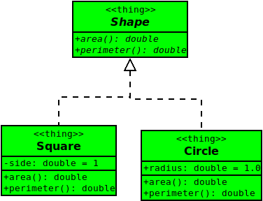

# LAB02 - Implementing Simple Class Hierarchies

As a means of increasing productivity, stubbing out operations allows us to proceed without having an entire solution to a problem.

## Background

Before proceeding with this lab, the student should take the time to read

* Appendix A of Carrano & Henry
* Chapter 1 of Carrano & Henry

## Objective

Upon successful completion of this lab, the student has learned how to

* specify an interface
* implement an interface using stubs
* demonstrate polymorphic behavior

## Getting Started

After accepting this assignment with the provided [GitHub Classroom Assignment link](https://classroom.github.com/a/yS1uTm26), decide how you want to work with your newly created repository:

- Using Codespaces directly in your web browser that employees the Visual Studio Code online IDE, or
- Using the IDE of your choice on your local machine

### Codespaces

If a Codespace is available for use (and this is your preferred method of development), open your new created repository in a Codespace.

At this point, you can skip to [Creating a development branch](#creating-a-development-branch).

### Local Development

Depending upon the IDE of your choice, many of the following steps may be taken within your IDE. It is up to you to discover these tools (assuming they're available) and learn how to use them appropriately as desired. The following instructions are assumed to take place within a terminal window. Note: many IDEs provide a terminal window as well.

#### Cloning your repository

The command you use to clone is slightly different depending upon whether you're using https or ssh.

If you're using the https protocol, your clone command is:

```shell
git clone https://github.com/msu-csc232-sp24/<repo-name>.git
```

If you're using the `ssh` protocol, your clone command is:

```shell
git clone git@github.com:msu-csc232-sp24/<repo-name>.git
```

After cloning the repository, navigate into the newly cloned repository:

```shell
cd <repo-name>
```

#### Creating a development branch

Next, create a branch named `develop`. Please note: The name of this branch **must** be as specified and will be, to the grading scripts, case-sensitive.

```shell
git checkout -b develop
```

Make sure you are on the `develop` branch before you get started. Make all your commits on the `develop` branch.

```bash
git status
```

_You may have to type the `q` character to get back to the command line prompt after viewing the status._

### Preparing to create PRs against your trunk

Because your assignments are forked from a template in GitHub, we want to ensure that when we create pull requests, we are seeking to merge into our trunk branch, and not that of the parent trunk.

Open a terminal window (either in your Codespace, or locally if you cloned your repo to your development machine) and type the following commands. 

Note: 

* Don't type the `$` character; this represents the command line prompt
* Substitute your actual GitHub username for the string `github-username` in these commands.

```shell
$ gh repo set-default msu-csc232-sp24/lab02-github-username
✓ Set msu-csc232-sp24/lab02-github-username as the default repository for the current directory
$ gh repo set-default --view
msu-csc232-sp24/lab02-github-username
```

Here, we use the `gh repo set-default` command. If you leave off the name at the end of the command, `gh` will give your choices, which is nice, in case you forget the format of the repo names. Finally, on line 4, we use the same `gh` command, albeit with the `--view` switch, to verify it's been changed as desired.

## Tasks

This lab consists of three tasks:

- Task 1: Specify the `Shape` interface
- Task 2: Implement the `Shape` interface (Square)
- Task 3: Implement the `Shape` interface (Circle)

By the time you have completed this lab, you will have realized the following design:



*Figure 1: Shape class hierarchy*

### Task 1: Specify the `Shape` interface

C++ doesn't have an `interface` keyword like some languages such as Java. However, we "mimic" the concept by creating an abstract class composed entirely of pure virtual member functions. Pure virtual functions are declared by beginning the declaration with the keyword `virtual` and ending the declaration with an assignment to 0. For example:

```c++
virtual someMethod() = 0;
```

In order to fully realize polymorphic behavior, we also need to specify a virtual destructor. Since, in this case today, nothing special needs to occur in this destructor, we can explicitly assign it a default implementation assigning it the keyword `default`. So, for `SomeClass`, the destructor would be declared as:

```c++
class Base {
public:
    virtual void someMethod() = 0; // pure virtual member function
    virtual ~Base() = default;     // virtual destructor
};
```

1. Using *Figure 1* as your guide, declare the `Shape` interface where specified by `TODO: 1.1` in [csc232.h](include/csc232.h)
2. Declare a default implementation of the interface's destructor.
3. Toggle the `FINISHED_PART_1` from `FALSE` to `TRUE`.
4. Test your code by executing the `tests` target.
5. When the test passes for Task 1, stage, commit and push your changes to GitHub.

### Task 2: Define the `Square` Class

Because we don't have "true" interfaces in C++ (we mimic them using abstract classes as outlined in Task 1), we actually implement the interface by extending some class, i.e., using inheritance. For now, we'll use public inheritance, which basically looks something like:

```c++
class Derived : public Base {
public:
    void someMethod() override {
       // provide inline implementation
    }
    ~Derived() = default;
private:
    // declare any necessary attributes
};
```

1. Using *Figure 1* as your guide, implement the `Shape` interface by defining the `Square` class inline where specified by `TODO: 2.1` in [csc232.h](include/csc232.h)
2. Toggle the `FINISHED_PART_2` from `FALSE` to `TRUE`.
3. Test your code by executing the `tests` target.
4. When the test passes for Task 2, stage, commit and push your changes to GitHub.

### Task 3: Define the `Circle` Class

1. Using *Figure 1* as your guide, implement the `Shape` interface by defining the `Circle` class inline where specified by `TODO: 3.1` in [csc232.h](include/csc232.h)
2. Toggle the `FINISHED_PART_3` from `FALSE` to `TRUE`.
3. Test your code by executing the `tests` target.
4. When the test passes for Task 3, stage, commit and push your changes to GitHub.

## Submission Details

Before submitting your assignment, be sure you have pushed all your changes to GitHub. If this is the first time you're pushing your changes, the push command will look like:

```bash
git push -u origin develop
```

If you've already set up remote tracking (using the `-u origin develop` switch), then all you need to do is type

```bash
git push
```

As usual, prior to submitting your assignment on Microsoft Teams, be sure that you have committed and pushed your final changes to GitHub. Once your final changes have been pushed, create a pull request that seeks to merge the changes in your `develop` branch into your `trunk` branch. Once your pull request has been created, submit the URL of your assignment _repository_ (i.e., _not_ the URL of the pull request) as a Link Resource on Microsoft Teams. Please note: the timestamp of the submission on Microsoft Teams is used to assess any late penalties if and when warranted, _not_ the date/time you create your pull request. **No exceptions will be granted for this oversight**.

### Due Date

Your assignment submission is due by the end of the lab period. Write access to your repository will end at 11:59 PM, Saturday, February 3, 2024.

### Grading Rubric

This assignment is worth **3 points**.

| Criteria           | Exceeds Expectations         | Meets Expectations                  | Below Expectations                  | Failure                                        |
|--------------------|------------------------------|-------------------------------------|-------------------------------------|------------------------------------------------|
| Pull Request (20%) | Submitted early, correct url | Submitted on-time; correct url      | Incorrect URL                       | No pull request was created or submitted       |
| Code Style (20%)   | Exemplary code style         | Consistent, modern coding style     | Inconsistent coding style           | No style whatsoever or no code changes present |
| Correctness^ (60%) | All unit tests pass          | At least 80% of the unit tests pass | At least 60% of the unit tests pass | Less than 50% of the unit tests pass           |

^ _The Google Test unit runner will calculate the correctness points based purely on the fraction of tests passed_.

### Late Penalty

* In the first 24-hour period following the due date, this lab will be penalized 0.6 point meaning the grading starts at 2.4 (out of 3 total possible) points.
* In the second 24-hour period following the due date, this lab will be penalized 1.2 points meaning the grading starts at 1.8 (out of 3 total possible) points.
* After 48 hours, the assignment will not be graded and thus earns no points, i.e., 0 out of 3 possible points.
